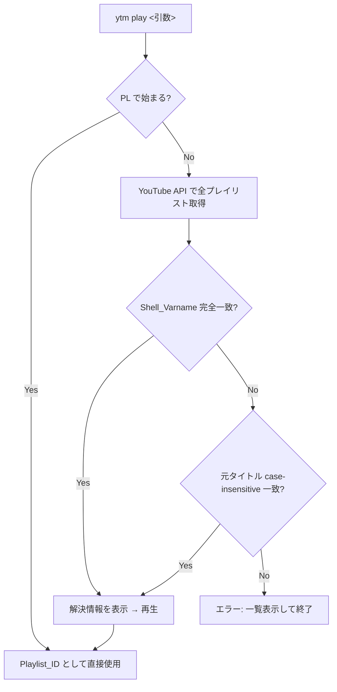

# Design Document (設計書)

## Overview

`ytm play` コマンドの引数として、YouTube プレイリスト ID だけでなくプレイリスト名（シェル変数名形式または元タイトル）を受け付けるようにする。名前が渡された場合、YouTube Data API v3 を呼び出してチャンネルの全プレイリストを取得し、名前からプレイリスト ID を内部的に解決する。

### 設計判断

- **単一ファイル構成を維持**: プロジェクトの設計方針に従い、`ytm` ファイル内に名前解決ロジックを追加する
- **既存の `fetch_all_playlists` を再利用**: `playlists` サブコマンドで使用している API 呼び出しロジックをそのまま活用する
- **既存の `to_shell_varname` を再利用**: シェル変数名への変換ロジックは既に実装済み

## Architecture

名前解決は `cmd_play` 関数の先頭で行い、既存の再生ロジックには手を加えない。



### 処理フロー

1. 引数が `PL` で始まる場合 → そのまま Playlist_ID として使用（API 呼び出しなし）
2. それ以外 → `fetch_all_playlists` で全プレイリストを取得
3. 各プレイリストに対して `to_shell_varname(title)` を計算し、引数と比較（完全一致）
4. 一致しなければ、各プレイリストの元タイトルと引数を大文字小文字無視で比較（完全一致）
5. 一致すれば解決情報を stderr に表示し、対応する ID で再生を開始
6. どちらにも一致しなければ、利用可能なプレイリスト名一覧をエラーとともに表示して終了

## Components and Interfaces

### 新規関数

#### `resolve_playlist_id(name: str) -> str`

引数の文字列をプレイリスト ID に解決する。

- **引数**: `name` — ユーザーが渡した文字列（Playlist_ID、Shell_Varname、または元タイトル）
- **戻り値**: 解決された YouTube プレイリスト ID
- **副作用**:
  - 名前解決が行われた場合、解決情報を `sys.stderr` に出力
  - 一致しない場合、エラーメッセージと一覧を `sys.stderr` に出力し `sys.exit(1)`

**内部ロジック**:

```python
def resolve_playlist_id(name: str) -> str:
    # 1. PL で始まる → 直接返す
    if name.startswith("PL"):
        return name

    # 2. API で全プレイリスト取得
    api_key = get_api_key()
    channel_id = get_channel_id()
    playlists = fetch_all_playlists(channel_id, api_key)

    # 3. Shell_Varname 完全一致
    for pl in playlists:
        if to_shell_varname(pl["title"]) == name:
            _print_resolved(pl)
            return pl["id"]

    # 4. 元タイトル case-insensitive 完全一致
    name_lower = name.lower()
    for pl in playlists:
        if pl["title"].lower() == name_lower:
            _print_resolved(pl)
            return pl["id"]

    # 5. 一致なし → エラー
    _print_no_match_error(name, playlists)
    sys.exit(1)
```

#### `_print_resolved(playlist: dict) -> None`

解決されたプレイリスト情報を stderr に表示する。

```
🎵 プレイリスト解決: "タイトル" (ID)
```

#### `_print_no_match_error(name: str, playlists: list[dict]) -> None`

一致しなかった場合のエラーメッセージと利用可能なプレイリスト一覧を stderr に表示する。

```
エラー: "name" に一致するプレイリストが見つかりません。

利用可能なプレイリスト:
  VARNAME                                  元タイトル
  ...
```

### 変更される既存コード

#### `cmd_play(args)`

- `args.playlist_id` を `resolve_playlist_id` に渡して解決済み ID を取得
- 以降の処理は変更なし

#### `argparse` 定義

- `play` サブコマンドの引数名を `playlist_id` から `playlist` に変更
- ヘルプ文を更新: プレイリスト ID またはプレイリスト名を受け付ける旨を記載

## Data Models

既存のデータ構造をそのまま使用する。新規のデータモデルは不要。

### 既存データ構造（変更なし）

| 構造 | 形式 | 用途 |
|------|------|------|
| プレイリスト | `{"title": str, "id": str}` | `fetch_all_playlists` の戻り値 |

### 引数の解釈パターン

| パターン | 判定条件 | 例 |
|---------|---------|-----|
| Playlist_ID | `name.startswith("PL")` | `PLxxxxxxxxxxxxxxxx` |
| Shell_Varname | `to_shell_varname(title) == name` | `YTM_MY_PLAYLIST` |
| 元タイトル | `title.lower() == name.lower()` | `My Playlist` |


## Correctness Properties

*プロパティとは、システムのすべての有効な実行において成り立つべき特性や振る舞いのことです。人間が読める仕様と機械的に検証可能な正しさの保証をつなぐ橋渡しとなります。*

### Property 1: PL プレフィックス文字列のパススルー

*For any* `PL` で始まる文字列 `s` に対して、`resolve_playlist_id(s)` は `s` をそのまま返し、API 呼び出しを行わず、stderr に解決情報を出力しない。

**Validates: Requirements 1.1, 4.2**

### Property 2: Shell_Varname による解決

*For any* プレイリストリスト `playlists` とその中の任意のプレイリスト `pl` に対して、`to_shell_varname(pl["title"])` を `resolve_playlist_id` に渡すと `pl["id"]` が返り、stderr に `pl["title"]` と `pl["id"]` が出力される。

**Validates: Requirements 1.3, 4.1**

### Property 3: 元タイトルの大文字小文字無視による解決

*For any* プレイリストリスト `playlists` とその中の任意のプレイリスト `pl` に対して、`pl["title"]` の大文字小文字を任意に変更した文字列を `resolve_playlist_id` に渡すと `pl["id"]` が返り、stderr に `pl["title"]` と `pl["id"]` が出力される。

**Validates: Requirements 1.4, 4.1**

### Property 4: 一致なしエラー

*For any* プレイリストリスト `playlists` と、そのどのプレイリストの Shell_Varname にも元タイトル（case-insensitive）にも一致せず `PL` で始まらない文字列 `s` に対して、`resolve_playlist_id(s)` は `sys.exit(1)` で終了し、stderr にエラーメッセージと利用可能なプレイリスト一覧が出力される。

**Validates: Requirements 1.5**

### Property 5: 解決の優先順位

*For any* プレイリストリスト `playlists` において、ある文字列が Shell_Varname と元タイトル（case-insensitive）の両方に一致する場合、`resolve_playlist_id` は Shell_Varname 一致のプレイリスト ID を返す。

**Validates: Requirements 2.1, 2.2**

## Error Handling

### 名前解決時のエラー

| エラー状況 | 処理 |
|-----------|------|
| API 呼び出し失敗（HTTP エラー） | 既存の `youtube_api_get` のエラーハンドリングがそのまま適用される。エラー詳細を stderr に表示し `sys.exit(1)` |
| ネットワークエラー | 既存の `youtube_api_get` のエラーハンドリングがそのまま適用される。ネットワークエラーの旨を stderr に表示し `sys.exit(1)` |
| 一致するプレイリストなし | 利用可能なプレイリスト名一覧をエラーメッセージとともに stderr に表示し `sys.exit(1)` |
| プレイリストが 0 件 | 「プレイリストが見つかりません」のエラーを stderr に表示し `sys.exit(1)` |

### 設計判断: API エラーハンドリングの再利用

`resolve_playlist_id` は内部で `fetch_all_playlists` → `youtube_api_get` を呼び出すため、API エラーとネットワークエラーは既存のエラーハンドリング（`youtube_api_get` 内の `try/except`）でカバーされる。新たなエラーハンドリングコードは不要。

## Testing Strategy

### テストフレームワーク

- **pytest**: ユニットテスト・プロパティテスト共通のテストランナー
- **Hypothesis**: Python 向けプロパティベーステストライブラリ

> 注: 現在テストフレームワークは未導入のため、pytest と hypothesis を開発依存として追加する。`ytm` は単一ファイルのため、テストファイルはプロジェクトルートに `test_ytm.py` として配置する。

### プロパティベーステスト

各 Correctness Property に対して Hypothesis を使用したプロパティテストを実装する。

- 最低 100 イテレーション/プロパティ
- 各テストにプロパティ番号をコメントで記載
- タグ形式: **Feature: playlist-name-play, Property {番号}: {プロパティ名}**
- `fetch_all_playlists` は `unittest.mock.patch` でモックし、API 呼び出しを回避

### ユニットテスト（例示ベース）

| テスト対象 | テスト内容 |
|-----------|-----------|
| API エラー時の終了 | `fetch_all_playlists` が HTTPError を投げた場合に `sys.exit(1)` |
| ネットワークエラー時の終了 | `fetch_all_playlists` が URLError を投げた場合に `sys.exit(1)` |
| ヘルプ文の更新確認 | `play` サブコマンドのヘルプにプレイリスト名の記述が含まれること |

### テスト構成

```
/
├── ytm                  # 本体（変更対象）
├── test_ytm.py          # テストファイル（新規作成）
└── ...
```

### テスト実行

```bash
pip install pytest hypothesis
pytest test_ytm.py -v
```
